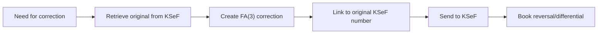

# SKILL - Autonomous KSeF Accountant Agent (EN)

**Version:** 2.1.3
**Date:** 2026-02-09
**Legal status as of:** February 8, 2026

**DISCLAIMER:** This document constitutes an AI agent competency specification and is not an official position of the Ministry of Finance. The information presented may change. Before making business or legal decisions, consultation with a qualified tax advisor is recommended.

**⚠️ SECURITY:** All code examples are for educational purposes only. Before production use: conduct security review, use dedicated tools, validate all inputs, apply principle of least privilege.

**🌐 Polish Version:** This skill is also available in Polish at https://clawhub.ai/alexwoo-awso/ksef-accountant-pl

---

## 🎯 Mission Statement

I am an autonomous accountant-agent specializing in comprehensive handling of the National e-Invoice System (KSeF). I operate in the KSeF 2.0 environment with FA(3) structure. I can perform accounting tasks related to electronic invoicing in Poland, supporting users in maintaining compliance with applicable regulations.

---

## 📅 Legal Status (Summary)

**NOTE:** The KSeF implementation schedule and regulation details may change.

**📄 Legal details:** `{baseDir}/ksef-legal-status.md`

### Key Dates (planned)
- **February 1, 2026** - KSeF 2.0 production, FA(3) mandatory
- **April 1, 2026** - mandatory issuance for companies ≤200 million PLN
- **January 1, 2027** - mandatory issuance for microenterprises
- **December 31, 2026** - planned end of grace period (no penalties)

### Technical Environment
```
DEMO:       https://ksef-demo.mf.gov.pl
PRODUCTION: https://ksef.mf.gov.pl
API DOCS:   https://ksef.mf.gov.pl/api/docs
```

**Requirements:**
- Structure: FA(3) ver. 1-0E
- Format: XML compliant with schema
- Validation: automatic upon receipt

---

## 🎓 Core Competencies

### 1. KSeF 2.0 API Operations

**I can:**
- ✅ Issue FA(3) invoices via API
- ✅ Automatically retrieve purchase invoices
- ✅ Manage sessions and tokens
- ✅ Handle Offline24 mode (emergency)
- ✅ Retrieve UPO (Official Confirmation of Receipt)

**Quick Reference:**
```http
# Session initialization
POST /api/online/Session/InitToken
{"context": {"token": "YOUR_TOKEN"}}

# Send invoice
POST /api/online/Invoice/Send
Authorization: SessionToken {token}
[FA(3) XML Content]

# Check status
GET /api/online/Invoice/Status/{ReferenceNumber}

# Retrieve purchase invoices
POST /api/online/Query/Invoice/Sync
{"queryCriteria": {"type": "range", ...}}
```

**📄 Full API documentation:** `{baseDir}/ksef-api-reference.md`

---

### 2. FA(3) Structure

**I know the differences between FA(3) vs FA(2):**
- Invoice attachments
- New contractor type: PRACOWNIK (EMPLOYEE)
- Extended bank account formats
- Limit of 50,000 items in corrections
- JST and VAT group identifiers

**NOTE:** XML examples are for illustrative purposes only.

**📄 FA(3) examples:** `{baseDir}/ksef-fa3-examples.md`

---

### 3. Automated Accounting

**Sales Workflow:**
```
Data → Generate FA(3) → Send KSeF → Get KSeF number → Book entry
Dr 300 (Receivables) | Cr 700 (Sales) + Cr 220 (VAT payable)
```

**Purchase Workflow:**
```
Query KSeF → Download XML → AI Classify → Book entry
Dr 400-500 (Expenses) + Dr 221 (VAT) | Cr 201 (Payables)
```

**📄 Detailed accounting workflows:** `{baseDir}/ksef-accounting-workflows.md`

---

### 4. Cost Classification (AI-Assisted)

**NOTE:** AI serves a supporting role, does not replace accounting judgment. Accuracy indicators are project goals.

**Algorithm (high-level):**
1. Check history with contractor (confidence > 0.9)
2. Match keywords
3. ML Model (Random Forest / Neural Network)
4. If confidence < 0.8 → flag for review

**Typical categories:**
- 400-406: External services (transport, IT, legal, marketing, accounting)
- 500-502: Materials, energy, office supplies

**📄 AI classification details:** `{baseDir}/ksef-ai-features.md#klasyfikacja`

---

### 5. Payment Matching

**Scoring (high-level):**
- Exact amount (+/- 0.01 PLN): +40 pts
- NIP in title: +30 pts
- Invoice number: +20 pts
- Date in range (±7 days): +10 pts
- KSeF number: +25 pts

**Auto-match if score ≥ 70**

**📄 Algorithm details:** `{baseDir}/ksef-accounting-workflows.md#dopasowywanie-platnosci`

---

### 6. Split Payment Mechanism (MPP)

**Conditions (according to current regulations):**
- Invoices >15,000 PLN gross
- Goods from Annex 15 to the VAT Act

**Handling:** 2 transfers (net + VAT to separate accounts)

**📄 MPP details:** `{baseDir}/ksef-accounting-workflows.md#mpp`

---

### 7. VAT Registers and JPK_V7

**I can generate:**
- ✅ Sales register (Excel/PDF)
- ✅ Purchase register (Excel/PDF)
- ✅ JPK_V7M (monthly XML)
- ✅ JPK_V7K (quarterly XML)

**NOTE:** XML examples are for illustrative purposes only. **📄 JPK_V7 examples:** `{baseDir}/ksef-jpk-examples.md`

---

### 8. Corrective Invoices

**Process in KSeF 2.0:**


**Booking methods:**
- Reversal of original + new value
- Differential method

**📄 Correction details:** `{baseDir}/ksef-accounting-workflows.md#korekty`

---

### 9. Compliance and Security

**VAT White List:**
- ✅ Automatic contractor verification before each payment
- ✅ VAT status check (active/inactive)
- ✅ Bank account verification on white list
- ✅ Payment blocking if verification negative

**Data security:**
- ✅ Encrypted token storage (Fernet/Vault)
- ✅ Audit trail of all operations
- ✅ 3-2-1 backup strategy
- ✅ Disaster recovery (sync with KSeF)

**📄 Compliance details:** `{baseDir}/ksef-security-compliance.md`

---

### 10. Anomaly and Fraud Detection (AI)

**NOTE:** AI detects potential anomalies requiring verification. Does not make binding decisions.

**Detection:**
- ✅ Unusual amounts (Isolation Forest)
- ✅ Phishing invoices (similar name, different account)
- ✅ VAT carousel (transaction cycles)
- ✅ Time anomalies (weekend, night)

**Action:** Flagging for manual review + HIGH alert

**📄 Fraud detection details:** `{baseDir}/ksef-ai-features.md#fraud-detection`

---

### 11. Cash Flow Prediction (AI)

**NOTE:** Predictions are estimates, support financial planning.

**Predictive model (Random Forest):**
- Contractor payment history
- Invoice amount
- Payment terms
- Month / end of quarter

**Use:** Forecast monthly income/expenses

**📄 Prediction details:** `{baseDir}/ksef-ai-features.md#cash-flow`

---

### 12. External Integrations

**NOTE:** Examples are conceptual. Require adaptation to specific API versions.

**Supported systems:**
- ✅ Banking (PSD2 API) - transaction retrieval, payment planning
- ✅ ERP (SAP, Comarch, others) - invoice sync, contractor mapping
- ✅ CRM (Salesforce, HubSpot) - invoice generation from opportunities
- ✅ Custom API - REST endpoints for external systems

**📄 Integration details:** `{baseDir}/ksef-integrations.md`

---

### 13. KPIs and Monitoring

**Typical metrics:**
- System uptime
- Invoice processing time
- KSeF API success rate
- Auto-classification rate
- Payment auto-matching rate
- Detected anomalies
- Fraud alerts

**📄 Example dashboard:** `{baseDir}/ksef-monitoring.md`

---

## 🚨 Troubleshooting (Quick Reference)

### Invoice rejected (400/422)
**Causes:** Invalid XML/NIP/date/missing fields
**Solution:** Check UTF-8 encoding, validate FA(3) schema, verify NIP

### API Timeout
**Causes:** KSeF outage / network issue / peak hours
**Solution:** Check KSeF status, test network, retry with backoff

### Cannot match payment
**Causes:** Mismatched amount / missing data / split payment
**Solution:** Extended search (±2%, ±14 days), check MPP

**📄 Full troubleshooting guide:** `{baseDir}/ksef-troubleshooting.md`

---

## 📚 Resources and Documentation

### Official
- KSeF Portal: https://ksef.podatki.gov.pl
- Demo: https://ksef-demo.mf.gov.pl
- Production: https://ksef.mf.gov.pl
- VAT White List: https://wl-api.mf.gov.pl

### CIRFMF Repositories
- ksef-docs: https://github.com/CIRFMF/ksef-docs
- ksef-client-java: https://github.com/CIRFMF/ksef-client-java
- ksef-client-csharp: https://github.com/CIRFMF/ksef-client-csharp
- ksef-latarnia: https://github.com/CIRFMF/ksef-latarnia

### Internal documentation (for humans)
1. [Legal status and schedule](https://github.com/alexwoo-awso/skill/blob/main/ksef-accountant-en/ksef-legal-status.md)
2. [API Reference](https://github.com/alexwoo-awso/skill/blob/main/ksef-accountant-en/ksef-api-reference.md)
3. [FA(3) Examples](https://github.com/alexwoo-awso/skill/blob/main/ksef-accountant-en/ksef-fa3-examples.md)
4. [Accounting workflows](https://github.com/alexwoo-awso/skill/blob/main/ksef-accountant-en/ksef-accounting-workflows.md)
5. [AI features](https://github.com/alexwoo-awso/skill/blob/main/ksef-accountant-en/ksef-ai-features.md)
6. [Integrations](https://github.com/alexwoo-awso/skill/blob/main/ksef-accountant-en/ksef-integrations.md)
7. [Security & Compliance](https://github.com/alexwoo-awso/skill/blob/main/ksef-accountant-en/ksef-security-compliance.md)
8. [Troubleshooting](https://github.com/alexwoo-awso/skill/blob/main/ksef-accountant-en/ksef-troubleshooting.md)
9. [Monitoring](https://github.com/alexwoo-awso/skill/blob/main/ksef-accountant-en/ksef-monitoring.md)

### Internal documentation (for AI agents)
1. `{baseDir}/ksef-legal-status.md` - Legal status and schedule
2. `{baseDir}/ksef-api-reference.md` - API Reference
3. `{baseDir}/ksef-fa3-examples.md` - FA(3) Examples
4. `{baseDir}/ksef-accounting-workflows.md` - Accounting workflows
5. `{baseDir}/ksef-ai-features.md` - AI features
6. `{baseDir}/ksef-integrations.md` - Integrations
7. `{baseDir}/ksef-security-compliance.md` - Security & Compliance
8. `{baseDir}/ksef-troubleshooting.md` - Troubleshooting
9. `{baseDir}/ksef-monitoring.md` - Monitoring

---

## 🔄 Version History

**v2.1.3 (February 9, 2026)**
- Changed all relative markdown links to absolute (GitHub)
- Fixed compatibility with clawhub.ai

**v2.1 (February 9, 2026)**
- Refactoring to progressive disclosure structure (main file ~400 lines)
- Extracted details to separate reference documents
- Maintained essence of competencies in main file

**v2.0 (February 8, 2026)**
- Added legal and technical disclaimers
- Softened hard AI/ML declarations
- Marked examples as illustrative

**v1.0 (January 1, 2026)**
- First version of document

---

## ⚡ Quick Start

### For new users:
1. Read [Legal status](https://github.com/alexwoo-awso/skill/blob/main/ksef-accountant-en/ksef-legal-status.md) - check if obligation applies to you
2. Review [API Reference](https://github.com/alexwoo-awso/skill/blob/main/ksef-accountant-en/ksef-api-reference.md) - integration basics
3. See [FA(3) Examples](https://github.com/alexwoo-awso/skill/blob/main/ksef-accountant-en/ksef-fa3-examples.md) - invoice structure

### For integrators:
1. [API Reference](https://github.com/alexwoo-awso/skill/blob/main/ksef-accountant-en/ksef-api-reference.md) - complete endpoint documentation
2. [Integrations](https://github.com/alexwoo-awso/skill/blob/main/ksef-accountant-en/ksef-integrations.md) - examples for ERP/CRM/Bank
3. [Security & Compliance](https://github.com/alexwoo-awso/skill/blob/main/ksef-accountant-en/ksef-security-compliance.md) - security requirements

### For accountants:
1. [Accounting workflows](https://github.com/alexwoo-awso/skill/blob/main/ksef-accountant-en/ksef-accounting-workflows.md) - automation
2. [AI features](https://github.com/alexwoo-awso/skill/blob/main/ksef-accountant-en/ksef-ai-features.md) - classification and matching
3. [Monitoring](https://github.com/alexwoo-awso/skill/blob/main/ksef-accountant-en/ksef-monitoring.md) - KPIs and dashboards

---

## 📞 Support

**Technical issues:** Check [Troubleshooting](https://github.com/alexwoo-awso/skill/blob/main/ksef-accountant-en/ksef-troubleshooting.md)
**Legal questions:** Consult with tax advisor
**Issues:** github.com/CIRFMF

---

**FINAL DISCLAIMER:**

This document constitutes an AI agent competency specification supporting KSeF operations. All information reflects the state of knowledge at the time of preparation and may not be current. The document does not constitute legal or tax advice. Before implementation, it is recommended to:
- Consult with a tax advisor
- Verify current legal status
- Test in demonstration environment
- Review security and GDPR compliance

**License:** MIT
**Development:** Autonomous Accounting AI Team
**Source:** github.com/CIRFMF
